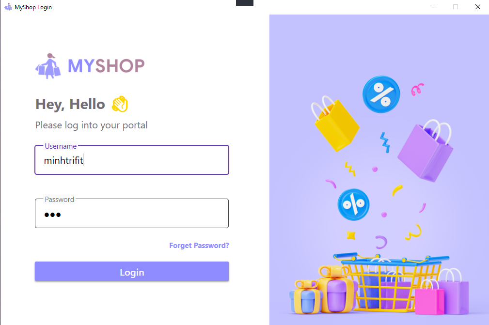
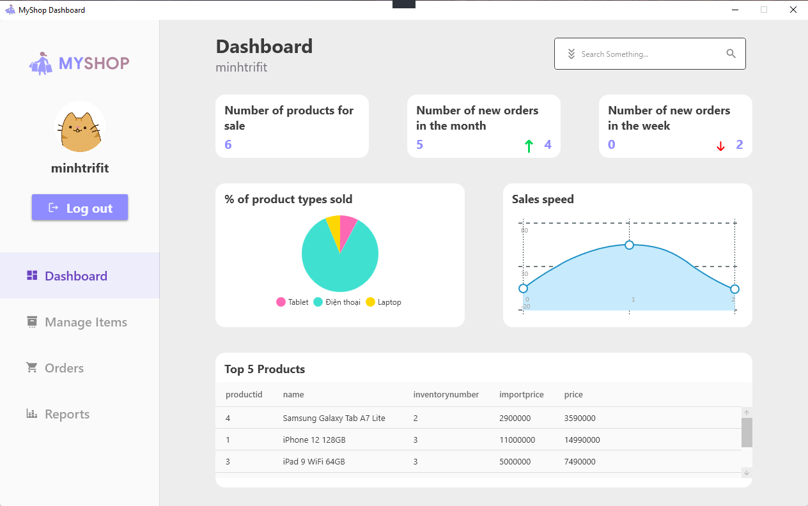

> # MyShop Project Documentation

## 1. Authors / Contributors
* [Nguyen Hai Dang (dangcpr)](https://github.com/dangcpr)
* [Le Minh Tri (minhtrifit)](https://github.com/minhtrifit)

## 2. Project Material

* [Github source code](https://github.com/minhtrifit)
* [Figma UI design](https://github.com/minhtrifit)
* [Demo video](https://github.com/minhtrifit)

## 3. Project Features

* Login Authentication (Hashed password in database)
* Dashboard showcase (show sale speed, product stats,...)
* Nodejs Server API

## 4a. Main App Config

* File path: ./MyShop/DAO/connectDatabaseDAO.cs
* Change database connect variables `host, port, user, pass, db`

## 4b. Server Config

* File path: ./server/config/dbConfig.js
* Change database connect variables `host, port, database, user, password`

## 4c. Run Database SQL Script

* Run w-p1.sql script to into project database

## 4c. Server Run

**Run with default command**

```php

cd ./server

npm install

npm run dev

```

## 5. Project Showcases

> **Login Screen**



***

> **Dashboard Screen**

